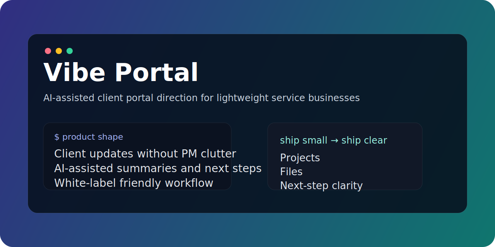

# Vibe Portal

AI-assisted client portal direction for lightweight service businesses.

## What it is

Vibe Portal is the product direction around a simpler, more modern client workspace where customers can:

- track project status
- read updates
- access files and links
- see next steps
- stay aligned without heavy PM software

## Why this direction

A lot of service businesses do not need a giant PM stack.

They need a branded client space that feels calm, clear, and easy to maintain — plus a workflow that can be improved with AI summaries, nudges, and operational assistance behind the scenes.

## Positioning

This repo is a public product-facing placeholder for the Vibe Portal concept.

It communicates product direction, positioning, and future packaging — not third-party source code with unclear licensing boundaries.

## Core ideas

- client communication without clutter
- lightweight portal UX
- AI-assisted operations and updates
- white-label friendly delivery
- service-business-first workflows

## Good fit for

- agencies with recurring client communication
- freelancers who need a cleaner client handoff experience
- studios shipping projects with files, updates, and approvals
- small teams who want a productized portal layer without heavy PM overhead

## Early roadmap

- product framing and positioning
- portal information architecture
- white-label / branding model
- AI-assisted summaries and next-step generation
- future packaging into a cleaner MVP

## Status

Early public repo / concept packaging.

## Related

- [client-portal](https://github.com/Chnurok/client-portal) — white-label client portal product framing
- [Chnurok](https://github.com/Chnurok) — profile and other product/tooling repos
